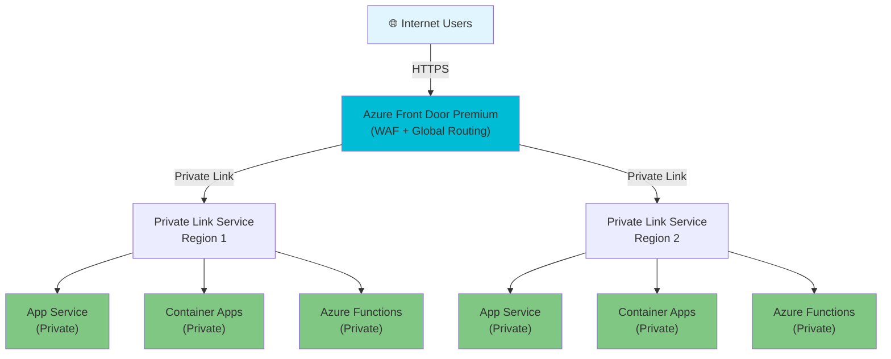
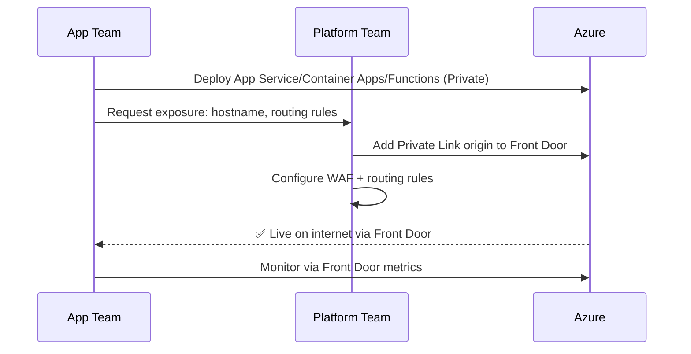
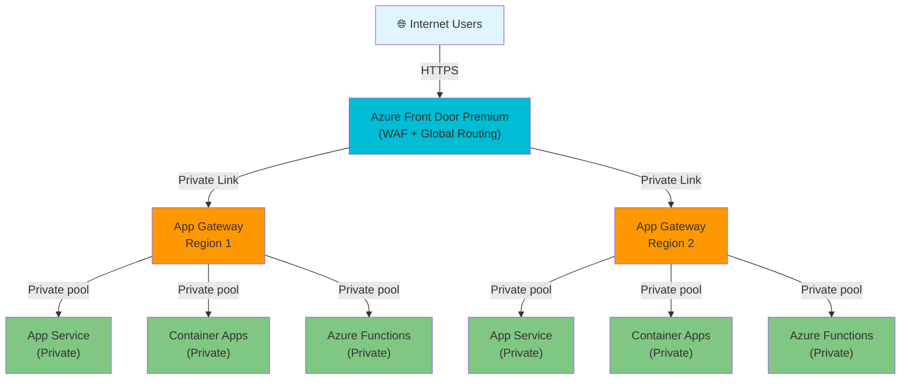
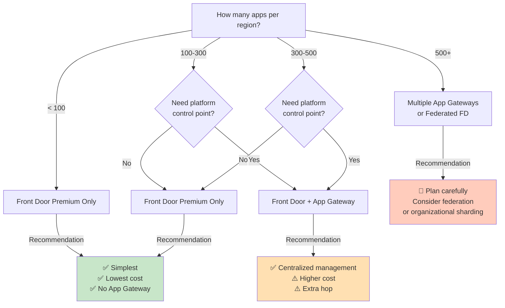
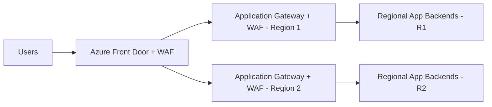
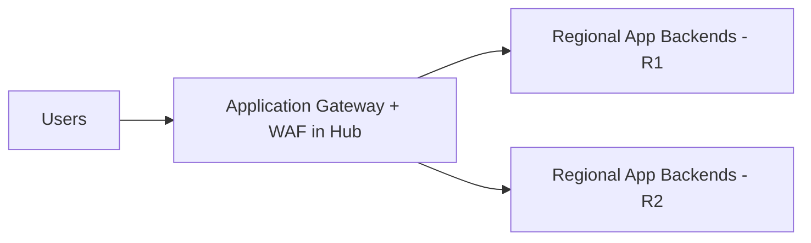
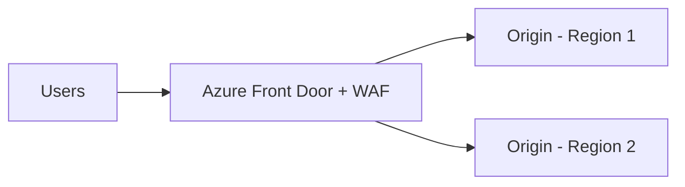
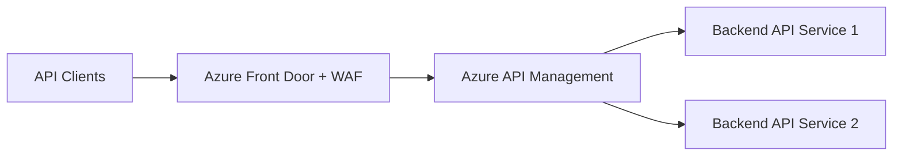
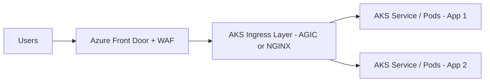

# Azure ingress architecture guidance for the options shown in the diagram

This document expands the architecture options shown in the image and maps them to Azure Learn and Azure Well-Architected guidance.

## Executive summary

For a typical **internet-facing, multi-region web application**, the **best default recommendation is Approach 3: Front Door in Hub**.

That recommendation aligns best with Azure guidance because:

- [Azure Front Door](https://learn.microsoft.com/en-us/azure/frontdoor/front-door-overview) is Azure's primary **global Layer 7 entry point** for HTTP/S applications.
- The [Azure load balancing guidance](https://learn.microsoft.com/en-us/azure/architecture/guide/technology-choices/load-balancing-overview) positions Front Door for **global** HTTP/S routing, acceleration, fast failover, and edge security, while [Application Gateway](https://learn.microsoft.com/en-us/azure/application-gateway/overview) is the **regional** Layer 7 option for ingress into private network space.
- The [Well-Architected guidance for Azure Front Door](https://learn.microsoft.com/en-us/azure/well-architected/service-guides/azure-front-door) explicitly assumes **multi-region active-active or active-passive** deployment and emphasizes routing methods, health probes, origin redundancy, host-name preservation, and minimizing session affinity.

However, **Approach 3 is not always the best**:

- If the workload is primarily an **API platform**, **Approach 4** is usually the better fit.
- If the workload is primarily **AKS ingress**, **Approach 5** is usually the better fit.
- If you need a **secondary ingress path for mission-critical resilience**, **Approach 1** can be justified despite its extra complexity and cost.

## Platform Team Scenario: Streamlined Multi-App Exposure

### Context

A platform team wants to provide a **standardized, cost-efficient way** for application teams to expose their services (App Service, Container Apps, Azure Functions) to the internet while maintaining **central control** over ingress security, routing, and configuration.

### CAF guidance note (explicit)

Azure Cloud Adoption Framework guidance says application delivery should happen within application landing zones and generally advises treating Application Gateway as an app component (spoke/workload aligned), while using Front Door for global HTTP/S delivery.

Reference: [Plan for application delivery (CAF)](https://learn.microsoft.com/en-us/azure/cloud-adoption-framework/ready/azure-best-practices/plan-for-app-delivery)

For cost-sensitive platform teams, a centralized Front Door Premium + Private Link model is a pragmatic interpretation of this guidance, with shared regional App Gateway added only when regional L7 controls are required.

### Recommended approach: Front Door Premium + Private Link (No App Gateway)

### Why this approach is optimal

| Aspect | Benefit |
|---|---|
| **Control** | Platform team owns Front Door origin config; app teams deploy privately only |
| **Cost** | Lowest cost — no per-region App Gateway; only Front Door Premium charges |
| **Scale** | Supports 50–300 apps per region without architectural changes |
| **Unified** | App Service, Container Apps, and Functions exposed identically via Private Link |
| **Simplicity** | No additional gateway hop; direct Private Link from Front Door to app origins |
| **Mission-critical** | Aligns with active-active regional stamp architecture pattern |

### Platform team onboarding workflow

### Service limits and scaling considerations

| Scale | Limit | Status | Mitigation |
|---|---|---|---|
| **50–100 apps/region** | Front Door: 1,000 origins | ✅ Safe | No action needed |
| **100–300 apps/region** | Front Door: 500 custom domains | ✅ Safe | Use wildcard domain (`*.platform.company.com`) |
| **300–500 apps/region** | Private Link service: 1,000 connections | ⚠️ Watch | Plan IP space; monitor connections |
| **500–1,000 apps/region** | VNet subnet exhaustion; route complexity | ⚠️ Plan | Shard by team/workload; add Private Link Services |
| **1,000+ apps** | Multiple limits reached | 🚨 Redesign | Consider federated Front Door or APIM layer |

### When to add Application Gateway

See the **CAF guidance note** above for the baseline recommendation and rationale, including the official reference link.

Add a **regional App Gateway per region** only if you need:

✅ **Central platform team control point** for all app onboarding (instead of individual Front Door origins)  
✅ **Regional WAF enforcement** independent of Front Door edge WAF  
✅ **Regional L7 routing** that differs from global routing  
✅ **Organizational segregation** (each team/workload type gets its own backend pool)  

❌ Do **not** add App Gateway just to scale beyond 300 apps—sharding Private Link Services or federating Front Door instances is better.

### Front Door + App Gateway hybrid (when needed)

**Cost impact**: Front Door Premium + App Gateway adds ~$200–400/month per region (2–3x more expensive than Front Door alone). Use only if operational benefits justify the cost.

### Cost comparison (for 500 apps across 2 regions)

| Architecture | Monthly Cost | Best for |
|---|---|---|
| **Front Door Premium only** | $50–100 | 50–300 apps; platform team wants minimal infra |
| **Front Door + App Gateway** | $250–400 | 300–500 apps; platform team wants central control point |
| **Front Door + Multiple App Gateways** | $400–600+ | 500–1000 apps; organizational segregation needed |
| **Federated/Multi-region Front Door** | $100–200+ per instance | 1000+ apps; multi-tenant or geography-based segmentation |

### Decision tree

### Final recommendation for platform teams

1. **Start with Front Door Premium + Private Link** — simplest, most cost-effective
2. **Monitor Front Door metrics** for origins, custom domains, and routing rule complexity
3. **At 300+ apps**, evaluate whether adding **regional App Gateway** is worth the cost for operational control
4. **At 500+ apps**, plan for **App Gateway sharding** (by team/workload) or **Private Link service sharding**
5. **At 1000+ apps**, consider **federated architecture** or **API Management** layer for true multi-tenant exposure

This approach aligns with **Azure mission-critical architecture patterns** (active-active regional stamps, global Front Door entry, private spoke apps) while giving platform teams a streamlined, scalable exposure model.

## Decision guide

| Approach | Best fit | General recommendation |
| --- | --- | --- |
| **1. App Gateway and Front Door in Hub** | Mission-critical ingress or combined global + regional control requirements | Use only when both layers are genuinely required |
| **2. App Gateway in Hub** | Regional applications, private ingress, or strong regional Layer 7 controls | Good regional design, but not the default for global apps |
| **3. Front Door in Hub** | Public multi-region web apps and APIs without heavy API-gateway needs | **Recommended default** |
| **4. Front Door and APIM in Hub** | API-first platforms needing governance, policy, auth, quotas, transformations | **Recommended for managed API estates** |
| **5. AKS with FD / AGIC** | Kubernetes ingress on AKS with global edge protection | **Recommended for AKS-centric internet ingress** |

## Approach 1: App Gateway and Front Door in Hub

### Pattern summary

Use **Azure Front Door** as the global edge and **Application Gateway** as the regional ingress tier behind it.

### Pros

- Combines **global routing and edge presence** from Front Door with **regional Layer 7 controls** from Application Gateway.
- Supports workloads that need **regional/private ingress behavior** before traffic reaches application backends.
- Can provide an architecture that is closer to the [mission-critical global HTTP ingress](https://learn.microsoft.com/en-us/azure/architecture/guide/networking/global-web-applications/mission-critical-global-http-ingress) guidance when alternate traffic paths or layered controls are required.
- Useful when you need to separate responsibilities between **global ingress** and **regional application delivery**.

### Cons

- Highest **operational complexity** of the non-AKS options.
- Higher **cost** because App Gateway is typically deployed per region and Front Door remains in front.
- Potential duplication of **WAF**, TLS, routing, and diagnostics responsibilities across two ingress layers.
- Feature overlap can create confusion about **where policies belong**.

### When to use it

- You need **Front Door for global routing** and **App Gateway for regional ingress** into private or hub-and-spoke networks.
- You need **regional request processing** that is better handled close to the workload.
- You want a design that can evolve toward a **mission-critical alternate ingress path**.
- You need to standardize on **hub-based regional ingress** while still presenting a global endpoint.

### When not to use it

- The app only needs a standard public global entry point.
- You do not have a clear need for **both** global and regional Layer 7 products.
- Cost and platform simplicity are higher priorities than layered ingress controls.

### Well-Architected guidance that matters here

- Front Door is best aligned to **global multi-region ingress**, origin health probes, and route selection based on active-active or active-passive strategies: [Azure Front Door guidance](https://learn.microsoft.com/en-us/azure/well-architected/service-guides/azure-front-door).
- App Gateway is best aligned to **regional application delivery**, zone-aware deployment, health probes, and backend protection: [Application Gateway guidance](https://learn.microsoft.com/en-us/azure/well-architected/service-guides/azure-application-gateway).
- Azure explicitly warns that combining Front Door and Application Gateway increases **operational complexity, cost, and feature-parity concerns**: [Mission-critical global HTTP ingress](https://learn.microsoft.com/en-us/azure/architecture/guide/networking/global-web-applications/mission-critical-global-http-ingress).

### Verdict

This is a **specialized architecture**, not the default recommendation. Use it only when you can point to requirements that justify both layers.

## Approach 2: App Gateway in Hub

### Pattern summary

Use **Application Gateway** as the primary ingress in the hub, typically routing traffic to regional workloads or private backends.

### Pros

- Strong **regional Layer 7 routing** and web application firewall capabilities.
- Good fit when traffic needs to transition from **public network space to private network space within a region**, which is exactly how Azure positions Application Gateway in the load-balancing guidance.
- Supports regional architectures that need **path-based routing, TLS offload, and backend pool control**.
- Simpler than running both Front Door and App Gateway together.

### Cons

- Not a global edge service, so it is not the best primary choice for **worldwide user populations**.
- Lacks the edge acceleration and distributed presence of Front Door.
- For multi-region topologies, you typically need additional routing components and more regional infrastructure.
- App Gateway does not provide the same **global failover and content-delivery** characteristics as Front Door.

### When to use it

- The workload is **regional**, not truly global.
- Backends are private and need a regional ingress service that is tightly integrated with hub networking.
- You need Application Gateway features and do not need Front Door's edge and global routing benefits.
- The design is centered on **regional spoke workloads** behind a hub.

### When not to use it

- The application serves users globally and needs a single high-performance global endpoint.
- You need edge WAF, global health probing, or route selection across multiple regions.
- You want the simplest recommended pattern for a public multi-region app.

### Well-Architected guidance that matters here

- Use **Application Gateway v2** for new deployments and deploy it in a **zone-aware** manner where supported: [Application Gateway guidance](https://learn.microsoft.com/en-us/azure/well-architected/service-guides/azure-application-gateway).
- Implement **health endpoint monitoring** and design carefully around health-probe frequency, thresholds, and downstream dependency validation.
- Avoid unnecessary network patterns that hurt reliability, and account for backend scaling and SNAT considerations.

### Verdict

This is a **good regional ingress pattern**, but it is **not the default best practice** when your real problem is global HTTP/S entry.

## Approach 3: Front Door in Hub

### Pattern summary

Use **Azure Front Door** as the main global ingress layer, terminating public HTTP/S traffic and routing to regional origins or hub-connected application endpoints.

### Pros

- Best aligned with Azure's recommended pattern for **global HTTP/S ingress**.
- Provides **global Layer 7 routing**, edge WAF, health probes, fast failover, and optional caching/acceleration.
- Simpler than combining multiple Layer 7 ingress products.
- Strong fit for **active-active** or **active-passive** multi-region application deployments.
- Helps keep the architecture focused on one global entry tier instead of duplicating routing and WAF logic.

### Cons

- Not a full API management platform.
- Not a replacement for every regional or private-ingress scenario.
- For the most stringent mission-critical requirements, you might still need a **redundant alternate routing path**.
- If the backend needs sophisticated regional ingress behavior, you might still introduce another layer later.

### When to use it

- Public, internet-facing **web applications** deployed in one or more regions.
- Applications that need **global routing**, edge security, and strong failover behavior.
- Architectures where simplicity, global reach, and standardized edge protection matter more than specialized regional ingress logic.
- Workloads that do not need deep API-product features from APIM.

### When not to use it

- You need API lifecycle and gateway capabilities such as **policies, transformations, developer portal, subscriptions, and productization**.
- The workload is primarily an AKS ingress problem with Kubernetes-specific ingress requirements.
- The service must remain reachable through a separately engineered fallback path beyond Front Door.

### Well-Architected guidance that matters here

- Choose the appropriate **active-active** or **active-passive** deployment strategy and align Front Door routing methods accordingly: [Azure Front Door guidance](https://learn.microsoft.com/en-us/azure/well-architected/service-guides/azure-front-door).
- Use **multiple origins**, proper **health probes**, and preserve the **same host name on each layer**.
- Avoid overuse of **session affinity**.
- Consider caching when it improves performance and resilience characteristics.

### Verdict

This is the **best and most broadly recommended option** in the diagram for a standard public multi-region application.

## Approach 4: Front Door and APIM in Hub

### Pattern summary

Use **Azure Front Door** as the global edge and **Azure API Management** as the API gateway/control plane in the hub.

### Pros

- Best match for **API-first architectures**.
- Front Door handles **global ingress, edge WAF, acceleration, and failover**.
- APIM adds **API-specific controls** such as authentication mediation, quotas, rate limits, transformations, versioning, products, developer experience, and policy-based governance.
- Strong alignment to enterprise API estates that want **centralized API governance**.

### Cons

- More expensive and operationally heavier than Front Door alone.
- Introduces another gateway hop and more policy surfaces to manage.
- Not necessary if the workload is just a web app with a few backend APIs and no API product-management requirements.
- APIM should not be selected purely as a load balancer; Azure explicitly treats it as an **API gateway platform**, not a general-purpose load balancer.

### When to use it

- The workload is primarily an **API platform**, not just a website.
- You need **quotas, subscriptions, policy enforcement, protocol mediation, transformations, or developer portal** features.
- You need centralized API governance across multiple backend services or domains.
- You want to front managed APIs with a global edge and separate the concerns of **traffic entry** and **API management**.

### When not to use it

- The application does not have serious API-management requirements.
- Front Door alone already meets the application's ingress needs.
- You are optimizing first for minimum cost and simplest architecture.

### Well-Architected guidance that matters here

- API Management production guidance emphasizes the recommended production tiers, observability, redundancy, scaling strategy, backend fault handling, quotas, rate limits, retries, and circuit breakers: [Azure API Management guidance](https://learn.microsoft.com/en-us/azure/well-architected/service-guides/azure-api-management).
- The reference architecture for protecting APIs with **Application Gateway + APIM** shows the same design principle of separating edge/network control from API gateway logic; Front Door can fill the global edge role where global routing is needed: [Protect APIs by using Azure Application Gateway and Azure API Management](https://learn.microsoft.com/en-us/azure/architecture/web-apps/api-management/architectures/protect-apis).
- Azure's load-balancing guidance states that APIM is **not a traditional general-purpose load balancer** and should be chosen for API gateway capabilities, not as a substitute for Front Door or App Gateway: [Load balancing options](https://learn.microsoft.com/en-us/azure/architecture/guide/technology-choices/load-balancing-overview).

### Verdict

This is the **best option for API-led platforms** in the diagram. If your workload is really an API estate, this is often better than Approach 3.

## Approach 5: AKS with FD / AGIC

### Pattern summary

Use **Azure Front Door** at the edge and an AKS ingress tier for workload routing inside Kubernetes. In the image, this is shown as **FD / AGIC**; the exact ingress implementation can vary, but the architecture intent is clearly **AKS-first ingress**.

### Pros

- Best fit when the application is fundamentally a **Kubernetes workload**.
- Front Door gives you **global ingress, WAF, and failover**.
- The AKS ingress tier keeps routing closer to the cluster and supports Kubernetes-native traffic patterns.
- Azure architecture guidance for securing AKS with Front Door strongly supports this general model for internet-facing AKS workloads.

### Cons

- More moving parts than Front Door alone.
- Requires careful ingress-controller, certificate, private connectivity, and cluster networking design.
- Can become complex if the cluster already has multiple ingress patterns or if responsibilities between edge and cluster ingress are unclear.
- Not the right default unless the workload is actually hosted on AKS.

### When to use it

- The application runs on **AKS** and must be exposed securely to the internet.
- You need **global edge protection** plus Kubernetes-native ingress behavior.
- You want to keep the application ingress model aligned to the AKS platform rather than forcing a generic regional pattern around it.

### When not to use it

- The workload is not on AKS.
- You do not need Kubernetes-native ingress behavior.
- A simpler non-Kubernetes application platform would be easier to operate.

### Well-Architected guidance that matters here

- Azure recommends a **WAF** for public AKS endpoints and provides a specific architecture using **Azure Front Door Premium**, WAF, Private Link, and ingress for secure exposure of AKS-hosted applications: [Use Azure Front Door to secure AKS workloads](https://learn.microsoft.com/en-us/azure/architecture/example-scenario/aks-front-door/aks-front-door).
- The Application Gateway guidance also calls out AKS-specific reliability and networking considerations, including scaling and container-networking-related ingress concerns: [Application Gateway guidance](https://learn.microsoft.com/en-us/azure/well-architected/service-guides/azure-application-gateway).

### Verdict

This is the **best option for AKS-hosted applications** in the diagram. It is not the general default, but it is the right answer when Kubernetes is the platform constraint.

## Practical recommendation by workload type

| Workload type | Recommended approach |
| --- | --- |
| Public multi-region web application | **Approach 3: Front Door in Hub** |
| Enterprise API platform | **Approach 4: Front Door and APIM in Hub** |
| Regional private-ingress application | **Approach 2: App Gateway in Hub** |
| Mission-critical application that needs layered/alternate ingress strategy | **Approach 1: App Gateway and Front Door in Hub** |
| Internet-facing AKS workload | **Approach 5: AKS with FD / AGIC** |

## Reference set

1. [Load balancing options - Azure Architecture Center](https://learn.microsoft.com/en-us/azure/architecture/guide/technology-choices/load-balancing-overview)
2. [Architecture best practices for Azure Front Door](https://learn.microsoft.com/en-us/azure/well-architected/service-guides/azure-front-door)
3. [Architecture best practices for Azure Application Gateway v2](https://learn.microsoft.com/en-us/azure/well-architected/service-guides/azure-application-gateway)
4. [Architecture best practices for Azure API Management](https://learn.microsoft.com/en-us/azure/well-architected/service-guides/azure-api-management)
5. [Mission-critical global HTTP ingress](https://learn.microsoft.com/en-us/azure/architecture/guide/networking/global-web-applications/mission-critical-global-http-ingress)
6. [Protect APIs by using Azure Application Gateway and Azure API Management](https://learn.microsoft.com/en-us/azure/architecture/web-apps/api-management/architectures/protect-apis)
7. [Use Azure Front Door to secure AKS workloads](https://learn.microsoft.com/en-us/azure/architecture/example-scenario/aks-front-door/aks-front-door)
